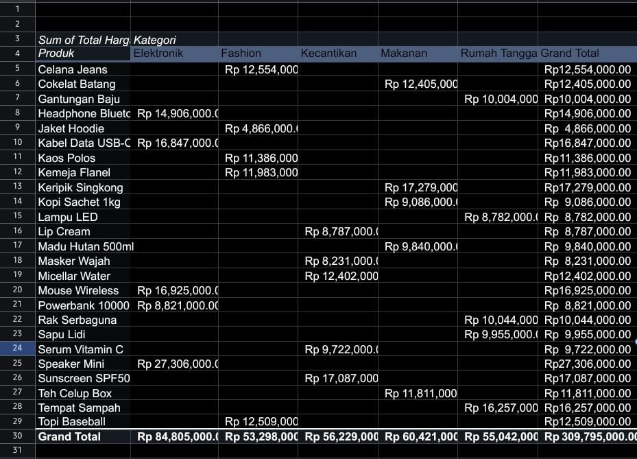

# Data Analyst Excel Project

##  Overview
Analisis data transaksi e-commerce(data dummy) yang memiliki order unik dengan menggunakan Microsoft Excel, mencakup proses data cleaning, deduplikasi, dan visualisasi penjualan.

##  Problem
Data mentah (655 baris) memiliki berbagai masalah kualitas data:
- Duplikasi record pada beberapa order
- Format tanggal tidak konsisten (contoh: "20/06/2025", "20 June 2025", "08-Apr-25")
- Nomor HP dengan format berbeda-beda (08xxx, +628xxx, 628xxx)
- Nama & kota dengan kapitalisasi dan spasi tidak konsisten
- Missing values pada kolom Qty & Harga Satuan

##  Process
1. **Data Cleaning** : TRIM, SUBSTITUTE, DATEVALUE untuk merapikan nama, kota, nomor HP, dan tanggal
2. **Deduplikasi** : mengurangi 655 baris menjadi 600 order unik
3. **Data Investigation** : menemukan bahwa 9 transaksi yang awalnya terlihat missing values ternyata datanya tersedia di baris duplikat lain yang ter-filter saat proses deduplikasi awal
4. **Analysis** : membangun PivotTable & visualisasi untuk penjualan per kategori, kota, dan status order
5. **Validation** :cross check seluruh total angka untuk memastikan konsistensi data

##  Key Finding
Sembilan transaksi awalnya diasumsikan sebagai missing values pada kolom Qty/Harga Satuan. Setelah ditelusuri lebih lanjut ke data mentah, ternyata data lengkap tersedia pada baris duplikat lain mennujukkan pentingnya cara deduplikasi yang mempertimbangkan kelengkapan data, tidak hanya menghapus baris pertama yang ditemukan.

##  Tools & Functions
Excel : TRIM, SUBSTITUTE, DATEVALUE, XLOOKUP, SUMIF, IFERROR, PivotTable, Conditional Formatting

##  Files
- [Raw Data](raw-data/Soal_Latihan_Excel_Data_Analyst%20%281%29.xlsx) data transaksi mentah (655 baris)
- [analysis](analysis/Latihan_Excel_Data_Analyst%20%281%29.xlsx) hasil cleaning, pivot table, dan grafik

##  Sample Output

